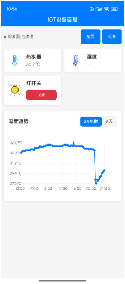
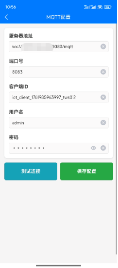
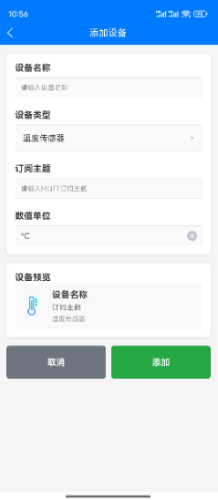
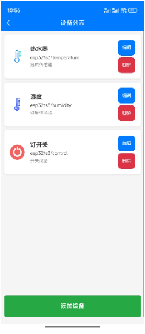
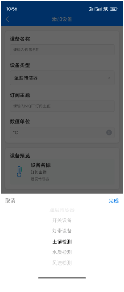

# 使用Trae快速开发的一个物联网小应用

一个基于uni-app框架开发的移动端IOT设备管理应用，支持设备绑定、状态监控、数据可视化和MQTT通信。

## 功能特性

### 🏠 主界面数据看板
- **无设备状态**: 引导用户进行MQTT配置和设备添加
- **设备状态展示**: 实时显示设备在线状态、数据值和最后更新时间
- **温度趋势图**: 支持24小时和7天的温度数据曲线展示

### ⚙️ MQTT配置管理
- 服务器地址和端口配置
- 客户端ID自动生成
- 用户名和密码认证
- 连接测试功能
- 配置本地存储

### 📱 设备管理
- **设备列表**: 查看所有已添加的设备
- **添加设备**: 支持多种设备类型（温度传感器、开关、LED等）
- **设备编辑**: 修改设备名称、类型和配置
- **设备删除**: 支持删除确认对话框

### 📊 数据可视化
- **实时数据**: 显示设备当前状态和数值
- **历史趋势**: 温度数据的时间序列图表
- **时间周期**: 支持24小时和7天视图切换
- **交互式图表**: 基于Canvas的自定义图表组件

### 🔗 MQTT通信
- 自动连接和重连机制
- 设备主题订阅
- 实时数据接收和处理
- 模拟数据生成（用于演示）

## 技术架构

### 前端框架
- **uni-app**: 跨平台开发框架
- **Vue 2**: 响应式前端框架
- **Canvas**: 自定义图表绘制

### 数据存储
- **uni.storage**: 本地数据持久化
- **内存缓存**: 实时数据和历史记录

### 通信协议
- **MQTT**: 物联网消息传输协议
- **WebSocket**: 实时双向通信演示图


## 演示图

<table>
    <tr>
        <td></td>
        <td></td>
    </tr>
    <tr>
        <td></td>
        <td></td>
    </tr>
    <tr>
        <td></td>
        <td></td>
    </tr>
</table>

## 项目结构

```
IOTDemo/
├── components/              # 组件目录
│   └── TemperatureChart.vue # 温度图表组件
├── pages/                  # 页面目录
│   ├── index/              # 主页面
│   ├── config/             # MQTT配置页面
│   ├── devices/            # 设备列表页面
│   └── addDevice/          # 添加设备页面
├── lib/                    # 调用库
│   └── mqttTool.js         # MQTT通信类库
├── static/                 # 静态资源
├── functionImg/            # 功能需求截图
├── App.vue                 # 应用入口
├── main.js                 # 主入口文件
├── pages.json              # 页面配置
├── manifest.json           # 应用配置
└── package.json            # 依赖配置
├── IOTESP32/               # MicroPython编写的ESP32程序
```

## 安装和运行

### 环境要求
- Node.js 12+
- HBuilderX 或 uni-app CLI
- 支持uni-app的开发环境

### 运行项目
```bash
# H5端开发
HBuilder X中运行到浏览器

# APP端
HBuilder X中运行到Android APP基座
```

### 预览应用
```bash
# 启动预览服务器
HBuilder X中运行到浏览器或安卓基座

# 访问 http://localhost:8080/
```

## 使用说明

### 1. MQTT配置
1. 点击"MQTT配置"按钮
2. 输入MQTT服务器地址和端口
3. 设置用户名和密码（可选）
4. 点击"测试连接"验证配置
5. 保存配置

### 2. 添加设备
1. 点击"添加设备"按钮
2. 输入设备名称
3. 选择设备类型（温度传感器、开关、LED等）
4. 配置MQTT主题
5. 设置设备参数（如温度单位、开关命令等）
6. 保存设备

### 3. 监控设备
- 主界面自动显示所有设备的实时状态
- 温度设备会显示历史趋势图
- 支持24小时和7天的数据查看
- 设备状态实时更新

### 4. 设备管理
- 在设备列表中查看所有设备
- 点击设备可进行编辑
- 长按设备可删除（需确认）

## 设备类型支持

### 传感器类型
- **温度传感器**: 显示温度值和历史趋势
- **湿度传感器**: 显示湿度百分比
- **水质传感器**: 显示水质指标

### 控制器类型
- **智能开关**: 开/关状态控制
- **LED灯**: 亮度和颜色控制
- **风扇**: 转速控制

## MQTT消息格式

### 设备状态上报
```json
{
  "device_id": "esp32_s3_temp_sensor",
  "temperature": 29,
  "unit": "°C",
  "timestamp": 20093
}
```

### 设备控制命令
```json
{
  "r": 0,
  "g": 0,
  "b": 0
}
三色灯全灭
{
  "r": 255,
  "g": 0,
  "b": 0
}
三色灯显示红灯。RGB的值是三色灯的亮度值，按需调整为需要的颜色
```

## 开发说明

### 添加新设备类型
1. 在`addDevice.vue`中添加设备类型选项
2. 在`mqtt.js`中添加对应的消息处理逻辑
3. 在主界面添加设备状态显示逻辑

### 自定义图表
- 修改`TemperatureChart.vue`组件
- 支持Canvas绘制和触摸交互
- 可扩展支持更多图表类型

### 扩展MQTT功能
- 添加新的主题订阅和消息处理
- 支持更复杂的设备协议

## 注意事项

1. **网络连接**: 确保设备能够访问MQTT服务器
2. **主题权限**: 确认MQTT用户有相应主题的订阅和发布权限
3. **数据格式**: 设备上报的数据需符合约定的JSON格式
4. **存储限制**: 历史数据存储在本地，注意存储空间限制

## 许可证

MIT License

## 更新日志

### v1.0.0 (2024-11-01)
- 初始版本发布
- 支持基础的设备管理和MQTT通信
- 实现温度数据可视化
- 完成主要功能模块开发