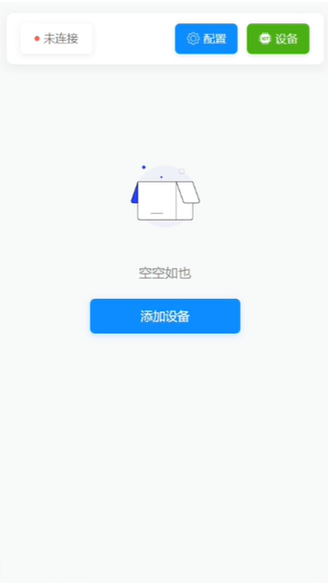
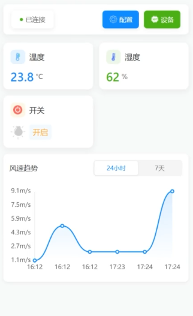
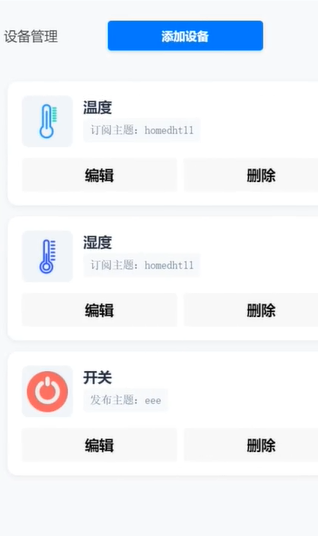
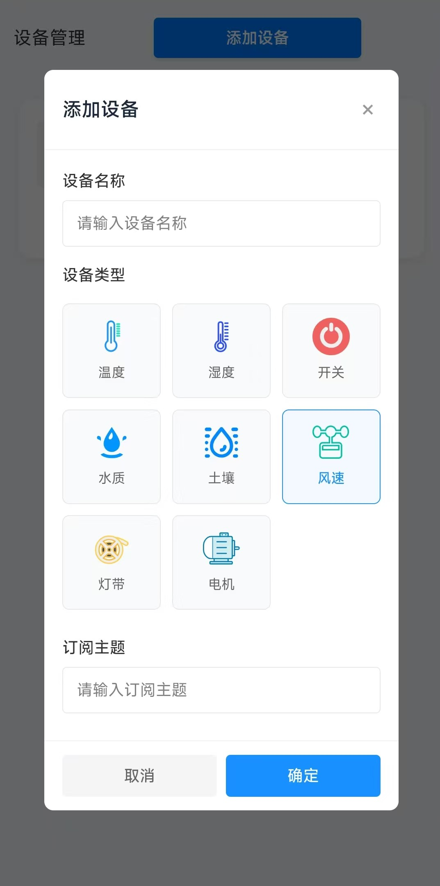
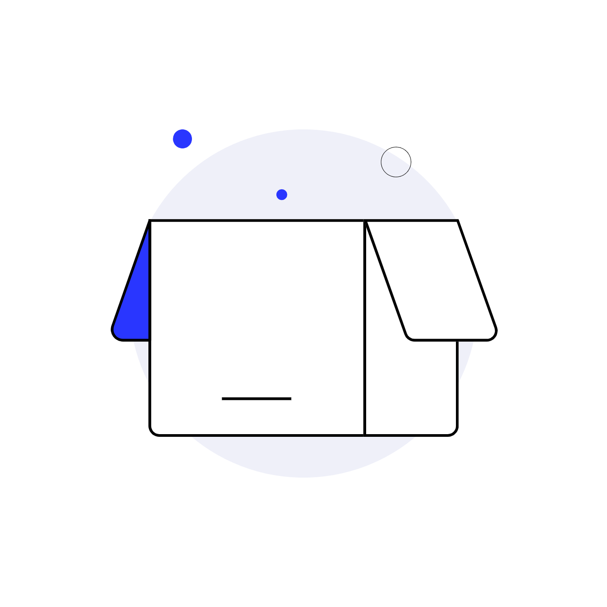

功能说明：
一款具备设备管理，设备数据看板功能的物联网应用软件。主页可以数据看板已经绑定的物联网设备，可以控制已绑定的设备。可以配置MQTT服务器连接参数，添加和删除设备。
## 1. 项目概述
- 项目名称：IOTDemo
- 目标平台：移动端（H5/混合应用，采用当前的uni-app模板，VUE2）
- 主要能力：设备绑定、状态展示、实时数据订阅、指令下发、日志记录、离线缓存
- 通信方式：MQTT
- 目标用户与场景：通过手机管理与监控设备状态

主界面：

未绑定设备时，显示“暂无设备”提示。如上图所示中间是“添加设备”按钮，点击即可新增设备。
最上方显示配置和设备按钮，点击配置按钮即可进入配置界面，点击设备按钮即可进入设备列表界面。

已绑定设备时，显示设备列表。如上图所示，最上方是“配置”和“设备”按钮，点击配置按钮即可进入配置界面，点击设备按钮即可进入设备列表界面。
中间显示设备的信息，温度和湿度显示实时采集的数值，如上图所示。开关则显示当前的开关状态。最下方显示温度传感器的采集数值曲线图，可切换24小时内数据或7天内数据显示曲线。

如图所示分别配置服务器地址、端口号、客户端ID、用户名和密码。

显示已经添加绑定的设备列表，如上图所示。显示设备的名称、订阅的主题、设备图标。可以编辑和删除设备。

点击添加设备按钮，即可新增设备。如上图所示，分别输入设备名称、选择设备类型，订阅主题。开关、风速、灯带设备需要增加开启命令和关闭命令的设置项。

图标文件：

